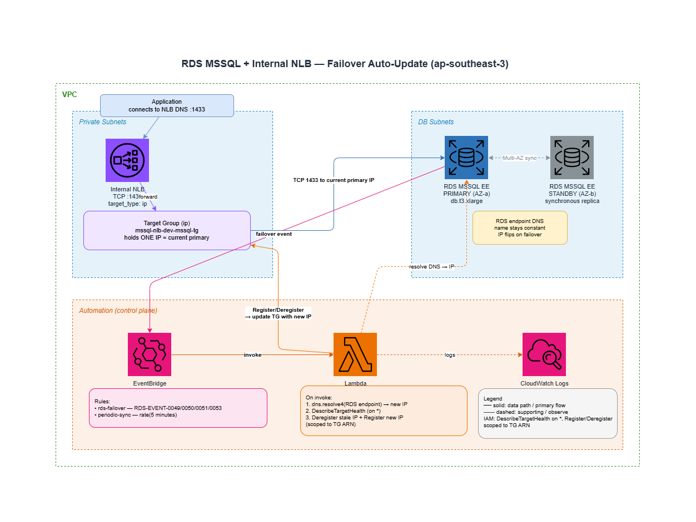

# Terraform AWS RDS MSSQL with Network Load Balancer (Failover Auto-Update)

Provisions an AWS RDS SQL Server Enterprise instance behind an internal Network Load Balancer (NLB), deployed in the Jakarta region (`ap-southeast-3`). Because the NLB forwards to the RDS instance by **IP address** (not DNS), a Lambda function keeps the NLB target group IP in sync with the current RDS endpoint — **automatically, on every Multi-AZ failover** — so client connections through the NLB keep working after the standby is promoted.

> Forked from a previous RDS + RDS Proxy setup. RDS Proxy was replaced with an NLB to avoid [SQL Server version compatibility limitations](https://docs.aws.amazon.com/AmazonRDS/latest/UserGuide/rds-proxy.html) and to support SQL Server 2022 (engine `16.00`).

---

## Table of Contents

- [Architecture](#architecture)
- [The Core Problem: Why an IP Updater Is Needed](#the-core-problem-why-an-ip-updater-is-needed)
- [Failover Auto-Update: How It Works](#failover-auto-update-how-it-works)
- [IAM Permissions (and the DescribeTargetHealth Gotcha)](#iam-permissions-and-the-describetargethealth-gotcha)
- [Disaster Recovery Drill](#disaster-recovery-drill)
- [Evidence](#evidence)
- [Quick Start](#quick-start)
- [Configuration](#configuration)
- [Outputs](#outputs)
- [Project Structure](#project-structure)
- [Operational Notes & Known Limitations](#operational-notes--known-limitations)
- [Why NLB Instead of RDS Proxy?](#why-nlb-instead-of-rds-proxy)
- [Destroy](#destroy)

---

## Architecture



**Connection path:** applications connect to the **NLB DNS name** on TCP 1433 (never the RDS endpoint directly). The NLB forwards to whichever IP is currently registered in the target group.

---

## The Core Problem: Why an IP Updater Is Needed

An NLB with an **IP-type** target group (`target_type = "ip"`) registers a concrete IPv4 address, not a hostname. RDS Multi-AZ failover works by promoting the standby and **re-pointing the RDS endpoint DNS record to the standby's IP** — the hostname stays the same, but the IP behind it changes (typically to an address in the standby's AZ subnet).

Without automation, the NLB would keep forwarding to the **old primary's IP** after a failover. That IP no longer hosts a healthy database, so every connection through the NLB fails until a human re-registers the new IP. The Lambda closes that gap automatically.

---

## Failover Auto-Update: How It Works

### Trigger sources (EventBridge → Lambda)

Defined in `lambda_nlb_updater.tf` via the `terraform-aws-modules/eventbridge/aws` module:

| Rule | Trigger | Purpose |
|------|---------|---------|
| `rds-failover` | RDS DB Instance Events `RDS-EVENT-0049`, `0050`, `0051`, `0053` | Fire **immediately** when a failover starts/completes |
| `periodic-sync` | `rate(5 minutes)` | Backstop sweep — catches any missed/edge-case drift |

The RDS event IDs:
- `RDS-EVENT-0049` — failover started
- `RDS-EVENT-0050` — failover completed
- `RDS-EVENT-0051` — Multi-AZ failover
- `RDS-EVENT-0053` — Multi-AZ failover complete

> EventBridge→Lambda invoke permissions are granted via standalone `aws_lambda_permission` resources rather than the Lambda module's `allowed_triggers`, to break the circular dependency between the Lambda and EventBridge modules (each needs the other's ARN).

### Lambda logic (`lambda/update_nlb_target.mjs`, Node.js 22.x, AWS SDK v3)

On each invocation the handler:

1. **Resolves** the RDS endpoint hostname to its current IPv4 (`dns.resolve4`).
2. **Describes** the target group's currently registered targets (`DescribeTargetHealth`).
3. **Short-circuits** if the single registered IP already equals the resolved IP → returns `{ status: "no_change" }`.
4. Otherwise **deregisters** stale targets (`DeregisterTargets`) and **registers** the new IP on port 1433 (`RegisterTargets`) → returns `{ status: "updated", old_ips, new_ip }`.

Environment variables (set by Terraform):

| Env var | Source |
|---------|--------|
| `TARGET_GROUP_ARN` | `module.nlb.target_groups["mssql"].arn` |
| `RDS_ENDPOINT` | `module.rds.db_instance_address` |
| `RDS_PORT` | `1433` |

### Initial registration

The very first IP is registered at apply time by the `aws_lb_target_group_attachment.mssql` resource in `nlb.tf`, which resolves the RDS endpoint using the `hashicorp/dns` provider (`data.dns_a_record_set.rds`). The Lambda then owns all subsequent updates.

---

## IAM Permissions (and the DescribeTargetHealth Gotcha)

The Lambda's IAM policy is **deliberately split into two statements** (`lambda_nlb_updater.tf`):

```hcl
# 1. DescribeTargetHealth does NOT support resource-level permissions.
#    It MUST be granted on "*". Scoping it to a target-group ARN throws
#    AccessDenied and crashes the handler before it can register the new IP.
allow_describe_target_health = {
  actions   = ["elasticloadbalancing:DescribeTargetHealth"]
  resources = ["*"]
}

# 2. Register/Deregister DO support resource-level permissions and are
#    scoped tightly to the target-group ARN.
allow_target_group_updates = {
  actions   = ["elasticloadbalancing:RegisterTargets",
               "elasticloadbalancing:DeregisterTargets"]
  resources = [module.nlb.target_groups["mssql"].arn]
}
```

> ⚠️ **Why this matters:** an earlier version scoped `DescribeTargetHealth` to the target-group ARN. During a failover drill the Lambda got `AccessDenied` on step 2 (describe), crashed before it could register the new IP, and the NLB kept pointing at the dead primary. The two-statement split (describe on `*`, mutate scoped to the ARN) is the fix. Keep them separate.

---

## Disaster Recovery Drill

`scripts/dr_failover_drill.sh` forces one Multi-AZ failover and timestamps every observable event to produce a **measured RTO** instead of a guess.

### Measured timeline

| Mark | Event | Measured by |
|------|-------|-------------|
| **T0** | Failover triggered (`reboot --force-failover`) | script |
| **T1** | RDS endpoint DNS resolves to a **new IP** (standby promoted) | DNS poll |
| **T2** | Lambda has **re-registered** the new IP in the NLB target group | TG describe |
| **T3** | New IP reports **HEALTHY** in the target group | TG health poll |
| **T4** | *(optional)* TCP connect to the NLB on 1433 succeeds | nc / bash tcp |

**Client-visible RTO = T3 − T0** (the point at which the NLB will forward traffic to a healthy database).

> **T4 is skipped by default** (`SKIP_T4=yes`): the NLB is **internal**, so it is unreachable from a drill host outside the VPC. To exercise T4, run with `SKIP_T4=no` from a host *inside* the VPC (bastion / in-VPC EC2 / VPC-attached CloudShell).

### Running the drill

The script derives all resource names from a single `NAME_PREFIX`, matching the Terraform `project_name` + `environment`:

```bash
cd scripts
./dr_failover_drill.sh
```

Default resolved names (with `project_name = "mssql-nlb"`, `environment = "dev"` → `NAME_PREFIX = mssql-nlb-dev`):

| Resource | Name |
|----------|------|
| RDS instance | `mssql-nlb-dev-mssql` |
| Target group | `mssql-nlb-dev-mssql-tg` |
| NLB | `mssql-nlb-dev-mssql-nlb` |
| Lambda | `mssql-nlb-dev-nlb-target-updater` |

Override any value inline without editing the script:

```bash
NAME_PREFIX=my-other-prefix ./dr_failover_drill.sh
# or per-resource:
DB_IDENTIFIER=... TG_NAME=... NLB_NAME=... LAMBDA_FN=... ./dr_failover_drill.sh
# tunables:
REGION=ap-southeast-3 POLL_INTERVAL=3 MAX_WAIT=600 SKIP_T4=no ./dr_failover_drill.sh
```

The script is **read-only except for the single `reboot --force-failover` call** — it does not modify Terraform, security groups, or the Lambda. Safe to run repeatedly.

### What a successful drill proves

- Failover completes and the endpoint IP flips (T1).
- The Lambda fires on the RDS event and re-registers the new IP **without manual intervention** (T2) — i.e. the IAM fix above is working.
- The new IP becomes healthy and the NLB resumes forwarding (T3).

Verify the Lambda actually fired by checking its CloudWatch Logs around T0–T2 (log group `/aws/lambda/mssql-nlb-dev-nlb-target-updater`).

---

## Evidence

### Drill run — 2026-10-08 (post-IAM-fix)

A full failover drill after the `DescribeTargetHealth` IAM fix was applied. The automation worked end-to-end: the Lambda fired on the RDS failover event and re-registered the new IP **with no manual intervention**, and the target became healthy at **T3 = +120s** (measured client-visible RTO).

```text
==> Preflight: resolving stack resources
2026-10-08T13:25:07Z  Endpoint:   mssql-nlb-dev-mssql.cd2sc4qkmzwm.ap-southeast-3.rds.amazonaws.com
2026-10-08T13:25:07Z  Status:     available
2026-10-08T13:25:07Z  Multi-AZ:   True
2026-10-08T13:25:07Z  Primary AZ: ap-southeast-3c
2026-10-08T13:25:07Z  Standby AZ: ap-southeast-3a
2026-10-08T13:25:08Z  Target group: arn:aws:elasticloadbalancing:ap-southeast-3:108782069919:targetgroup/mssql-nlb-dev-mssql-tg/7164d48f7a5084c6
2026-10-08T13:25:09Z  NLB DNS:    mssql-nlb-dev-mssql-nlb-0849a30867f0faf4.elb.ap-southeast-3.amazonaws.com

==> Baseline capture (BEFORE failover)
2026-10-08T13:25:09Z  RDS endpoint currently resolves to: 10.0.33.222
Target group registered IP(s) / state:
10.0.33.222     healthy

Type 'FAILOVER' to proceed: FAILOVER

==> T0 -- triggering failover
[ OK ] Failover requested at 2026-10-08T13:25:15Z (T0)

==> T1 -- waiting for RDS endpoint to flip to a NEW IP
[ OK ] Endpoint flipped: 10.0.33.222 -> 10.0.31.217  (T1 = +86s)

==> T2 -- waiting for Lambda to register the new IP in the target group
[ OK ] New IP 10.0.31.217 registered in target group  (T2 = +89s)

==> T3 -- waiting for the new IP to report HEALTHY
[ OK ] New IP 10.0.31.217 is HEALTHY  (T3 = +120s)
[WARN] T4 skipped (SKIP_T4=yes): internal NLB not reachable from this host. RTO is measured to T3 (target healthy).

==> Lambda invocation evidence (CloudWatch Logs, last 10 min)
    2026-10-08T13:26:42.778Z  d92e2a13-...  INFO  Successfully updated target group. Old IPs: 10.0.33.222 -> New IP: 10.0.31.217
[ OK ] Lambda logged an 'updated' event (confirms it drove the re-registration)

==> DR DRILL SUMMARY
-------------------------------------------------------------
  T0  failover triggered        2026-10-08T13:25:15Z
  T1  endpoint IP changed        +86s
  T2  new IP in target group     +89s
  T3  new IP HEALTHY             +120s
  T4  NLB TCP connect            skipped (internal NLB)
-------------------------------------------------------------
  MEASURED RTO (client-visible, T3 - T0): 120s
-------------------------------------------------------------
  Old IP: 10.0.33.222   New IP: 10.0.31.217
  Note: RPO for Multi-AZ synchronous replication is ~0 (no committed data loss).
```

**Result summary**

| Metric | Value |
|--------|-------|
| Measured RTO (client-visible, T3 − T0) | **120 s** |
| RPO (Multi-AZ synchronous replication) | **~0** (no committed data loss) |
| Endpoint flip (T1) | +86 s |
| Lambda re-registered new IP (T2) | +89 s — fired on the RDS failover event, no manual action |
| New IP healthy (T3) | +120 s |
| Old IP → New IP | `10.0.33.222` → `10.0.31.217` |

> **Note on the "Primary AZ unchanged" warning:** the script's post-failover AZ read runs after RDS has settled, and the `describe-db-instances` AZ field can read back to the original value by then. This is a cosmetic quirk of the read timing — the failover is independently proven by the endpoint IP flip (T1), the Lambda re-registration (T2), and the healthy new target (T3). It does **not** indicate the failover failed.

---

## Quick Start

### Prerequisites

- AWS CLI configured with appropriate credentials
- An existing VPC with tagged subnets (DB subnets + private subnets)
- An existing S3 bucket for Terraform state

### 1. Configure backend

Edit `provider.tf` and set your S3 bucket name:

```hcl
backend "s3" {
  bucket = "your-terraform-state-bucket"
  key    = "rds-mssql-nlb/terraform.tfstate"
  region = "ap-southeast-3"
}
```

### 2. Create your variables file

```bash
cp terraform.tfvars.example terraform.tfvars
```

Edit `terraform.tfvars` with your actual tag names and project name:

```hcl
vpc_tag_name            = "production-vpc"
db_subnet_tag_name      = "db-subnet-*"
private_subnet_tag_name = "private-subnet-*"
project_name            = "mssql-nlb"
environment             = "dev"
```

> **Note:** Subnet tag filters support wildcards. Use `*` to match multiple subnets (e.g. `private-subnet-*` matches `private-subnet-1a`, `private-subnet-1b`). The `project_name` + `environment` form the `NAME_PREFIX` used throughout (and by the DR drill script).

### 3. Deploy

```bash
terraform init
terraform plan
terraform apply
```

### 4. Get connection info

```bash
terraform output nlb_dns_name              # NLB endpoint — use this in your application
terraform output rds_instance_endpoint     # Direct RDS endpoint — admin/debug only
terraform output rds_credentials_secret_arn # Secrets Manager ARN for credentials
```

### Retrieving database credentials

The master password is stored in AWS Secrets Manager:

```bash
aws secretsmanager get-secret-value \
  --secret-id $(terraform output -raw rds_credentials_secret_arn) \
  --region ap-southeast-3 \
  --query SecretString \
  --output text
```

---

## Configuration

| Variable | Description | Default |
|----------|-------------|---------|
| `aws_region` | AWS region to deploy resources | `ap-southeast-3` |
| `vpc_tag_name` | Tag Name to filter existing VPC | (required) |
| `db_subnet_tag_name` | Tag Name to filter DB subnets | (required) |
| `private_subnet_tag_name` | Tag Name to filter private subnets | (required) |
| `project_name` | Project name for resource naming | `mssql-proxy` ¹ |
| `environment` | Environment name | `dev` |
| `db_username` | Master DB username | `admin` |
| `db_instance_class` | RDS instance class | `db.t3.xlarge` |
| `db_allocated_storage` | Initial storage (GB) | `20` |
| `db_max_allocated_storage` | Max autoscale storage (GB) | `100` |
| `db_engine_version` | MSSQL engine version | `16.00` |
| `tags` | Common tags to apply to all resources | `{}` |

¹ The variable **default** is still `mssql-proxy`, but this deployment sets `project_name = "mssql-nlb"` in `terraform.tfvars`, producing the `mssql-nlb-dev-*` resource names. Set it explicitly in your tfvars.

---

## Outputs

| Output | Description |
|--------|-------------|
| `nlb_dns_name` | NLB DNS name (application connection endpoint) |
| `nlb_arn` | ARN of the Network Load Balancer |
| `rds_instance_endpoint` | Direct RDS endpoint (admin use) |
| `rds_instance_id` | RDS instance identifier |
| `rds_instance_port` | RDS instance port |
| `rds_credentials_secret_arn` | Secrets Manager secret ARN |
| `rds_security_group_id` | RDS security group ID |
| `nlb_security_group_id` | NLB security group ID |
| `lambda_nlb_updater_function_name` | Lambda function name |
| `lambda_nlb_updater_arn` | Lambda function ARN |

---

## Project Structure

```
.
├── data.tf                     # VPC and subnet data sources
├── lambda/
│   └── update_nlb_target.mjs   # Lambda: resolves RDS IP and updates NLB targets
├── lambda_nlb_updater.tf       # Lambda function, EventBridge rules, IAM, permissions
├── nlb.tf                      # NLB, target group, listener, initial IP attachment
├── rds.tf                      # RDS instance, Secrets Manager, DB subnet group
├── security_groups.tf          # Security groups for RDS and NLB
├── outputs.tf                  # Terraform outputs
├── provider.tf                 # Provider config and S3 backend
├── variables.tf                # Input variables
├── terraform.tfvars.example    # Example variable values
└── scripts/
    └── dr_failover_drill.sh    # Multi-AZ failover drill (measures RTO, T0–T4)
```

---

## Operational Notes & Known Limitations

- **Multi-AZ:** **Enabled** (`multi_az = true` in `rds.tf`) — the whole point of the failover auto-update mechanism.
- **NLB health check is TCP-only on 1433.** It confirms the port is *open*, not that the SQL Server login is accepting connections. A target can read HEALTHY slightly before the database is truly serving queries. Consider a deeper application-level check if you need that guarantee.
- **Periodic sync is `rate(5 minutes)`.** This is the backstop if an event is missed; worst-case drift before the sweep corrects it is up to 5 minutes. Tighten to `rate(1 minute)` in `lambda_nlb_updater.tf` if you want a faster backstop (small extra invocation cost).
- **Instance class:** `db.t3.xlarge` is the smallest supported class for MSSQL Enterprise Edition.
- **Storage:** gp3, encrypted.
- **Deletion protection:** disabled for dev (both RDS and NLB). **Enable for production.**
- **Lambda runtime:** Node.js 22.x, AWS SDK v3.
- **DNS provider:** `hashicorp/dns` is used at plan/apply time for the *initial* target registration only; the Lambda owns all runtime updates.

---

## Why NLB Instead of RDS Proxy?

AWS RDS Proxy does **not** support SQL Server 2022 (engine version `16.00`); supported versions are limited to SQL Server 2016–2019. An NLB removes this constraint and allows running the latest SQL Server engine.

The tradeoff is that an NLB provides neither connection pooling nor IAM-based authentication the way RDS Proxy does. The Lambda + EventBridge pattern documented above handles the main operational concern — IP changes during failover — automatically.

---

## Destroy

```bash
terraform destroy
```
